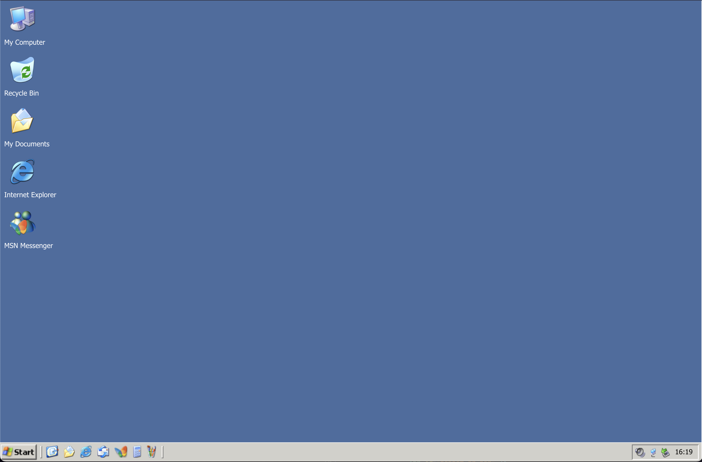
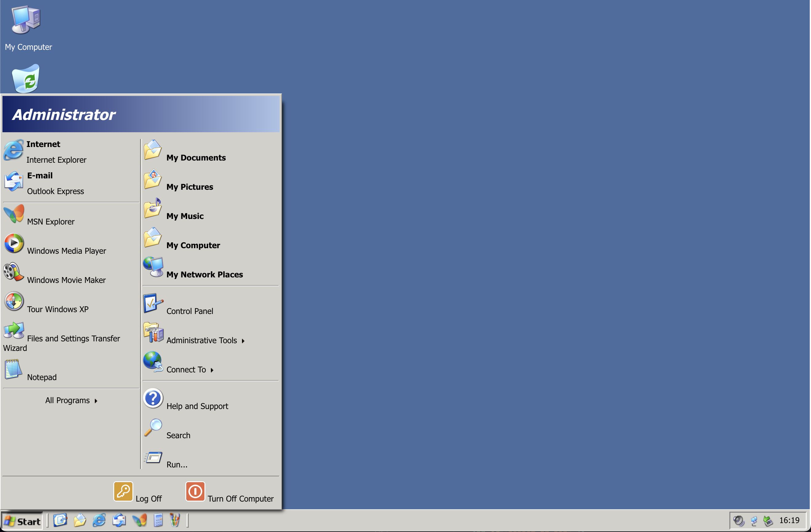

# Windows XP Desktop Re-creation

This is my attempt to recreate the Windows XP Classic Theme desktop using only vanilla HTML, CSS and JavaScript DOM manipulation.

It's a bit of fun, and a little hobby project to help me get deeper into CSS and DOM events 🎉

<strong>It's been mostly built and tested with the <a target="_blank" rel="noopener noreferrer" href="https://brave.com/">`Brave Browser`</a>, and `Safari`.</strong>

_Note: Windows XP, XP logo and all icons/other logos are Microsoft's property._

## 📷 Demo Images and Video 🎥

 

**Image 1 (Desktop):**

 

**Image 2 (With Start Menu visible):**

 

**Short Video Demo:**

<video width="80%" height="80%" controls>
  <source src="./readme_assets/windows_desktop_demo.mov"type="video/mp4">
  Your browser does not support the video tag.
</video>
